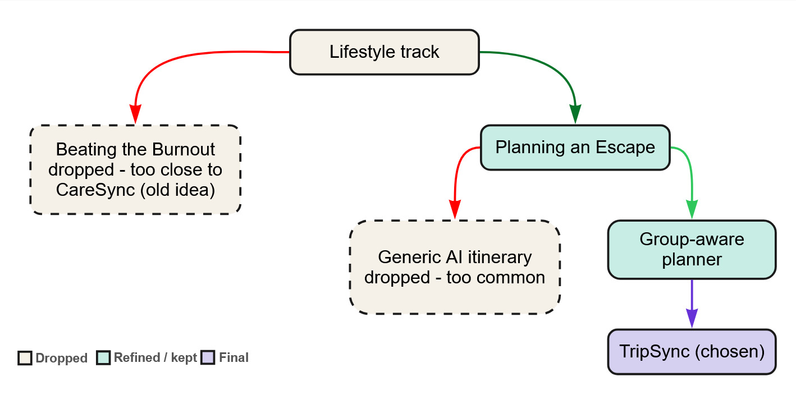
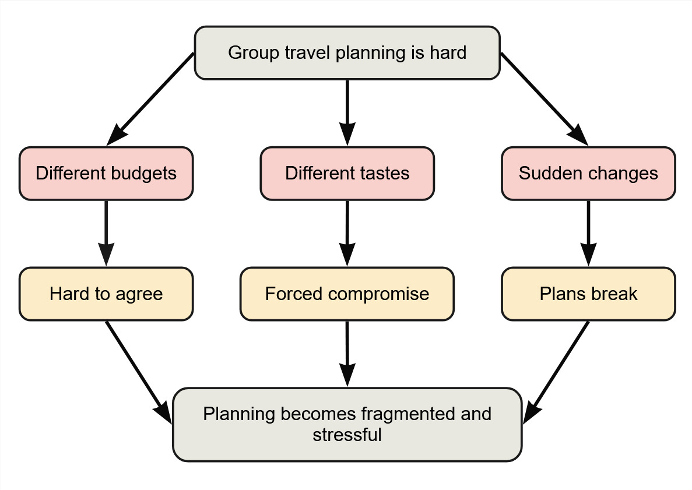
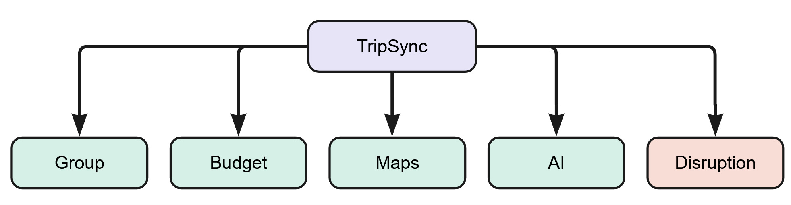
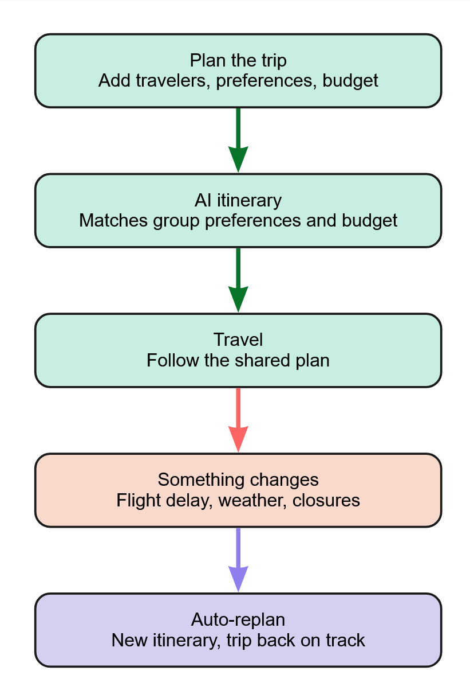

# TripSync

### Adaptive group travel planning for changing plans

TripSync keeps a shared itinerary useful when real life gets in the way. It combines group preferences and budgets, then automatically replans around disruptions such as delays, bad weather, or closures.

**Built for Codenection 2026 · Lifestyle Track: Planning an Escape**

Video presentation: link to be added · Presentation slides: link to be added

## At A Glance

| | |
|---|---|
| **Team** | Pavithiran · Krishnaraj · Rakesh |
| **Core idea** | A living itinerary that adapts when plans change |
| **Frontend** | Flutter |
| **Backend** | Firebase / Firestore |
| **AI layer** | Gemini via Vertex AI |

## Contents

- [Project Overview](#1-project-overview)
- [Ideation & Process](#2-ideation--process)
- [Design & Prototype](#3-design--prototype)
- [What Makes It Different](#4-what-makes-it-different)
- [Technical Architecture & Feasibility](#5-technical-architecture--feasibility)

---

## 1. Project Overview

### The Problem

Planning a trip means juggling flights, accommodation, budgets, activities, and everyone's individual preferences - usually scattered across five different apps and a group chat. Most existing travel apps solve only one piece of this: bookings, budgeting, or itineraries, but not all three together. Group trips make it worse, since aligning schedules, budgets, and preferences across multiple people is difficult to do by hand. When something changes mid-trip - a delayed flight, bad weather, or a closed venue - travelers are usually left to rebuild the plan themselves.

**Stakeholders:** young adults and university students traveling in groups, who typically have limited planning experience, mismatched budgets, and shared logistics (transport, accommodation) that need to stay coordinated.

**Existing solutions and where they fall short:** apps like Wanderlog and TripIt handle itinerary organization well, but treat the itinerary as a static document - once a flight is delayed or a venue is closed, the user is left to manually rebuild the plan themselves. None of the major travel-planning apps offer real-time, automatic replanning that accounts for group preferences, budget, and travel time simultaneously.

### Our Solution

**TripSync** is an adaptive group travel planner that doesn't just help you build an itinerary - it keeps that itinerary alive when reality changes. Travelers each set their own budget and interests, TripSync merges them into a single AI-generated itinerary, and when something disrupts the plan mid-trip, TripSync automatically recalculates the affected schedule while preserving group preferences and budget constraints.

**Feature set:**
- Group preference sync - combine multiple travelers' budgets and interests into one plan
- AI-generated itinerary - day-by-day plan matched to combined group preferences and budget
- Budget dashboard - per-category spend tracking and per-person cost split
- Disruption detection - simulate real-world changes (flight delay, weather, closures)
- Auto-replanning engine - recalculates the itinerary transparently, showing what was removed, moved, or added

---

## 2. Ideation & Process

### 2.1 Ideas We Considered

| Idea | Why it was dropped / kept |
|---|---|
| **TripSync - adaptive group travel planner (Chosen)** | Directly targets the problem statement's explicit gap: "when something changes mid-trip, there's rarely any real help... in adjusting." Differentiates from every existing itinerary app by treating the plan as living, not static. |
| **Group-aware travel planner** | Kept and refined further - solved for combining multiple travelers' preferences and budgets into one itinerary, but didn't yet address the mid-trip disruption gap named in the problem statement. |
| Generic AI itinerary generator | Dropped - "tell us your destination and budget, AI generates an itinerary" is one of the most common hackathon travel concepts; wouldn't differentiate from existing submissions or existing apps. |
| Beating the Burnout (stress & workload manager) | Dropped - while a strong problem fit, it risked reading as "CareSync AI 2.0 with a student-workload skin," reusing the same wellbeing-tracker-plus-AI-summary pattern as a prior project. Chose to demonstrate range instead. |

### 2.2 Ideation Boards

  

<em>Shows the narrowing path from the Lifestyle track down to TripSync, including the two intermediate ideas that were dropped along the way and why.</em>

  

<em>Breaks down why group travel planning is hard - three root causes (budgets, tastes, sudden changes) and the consequences each one creates.</em>

  

<em>TripSync's five functional pillars: group sync, budget, maps, AI itinerary generation, and disruption handling.</em>

  

<em>The end-to-end loop a traveler moves through: plan the trip, get an AI itinerary, travel, hit a disruption, and get an automatic replan.</em>

### 2.3 Mentor Consultation

| Date | Mentor | Feedback Received | What Was Changed |
|---|---|---|---|
| 8 September 2026 | Teng Wei Herr | He recommended researching the market further, exploring indie apps, and developing a distinctive feature that most existing apps do not offer. He also shared suggestions for managing API rate limits, using the OpenCode API as an example. | Surveyed indie apps such as Trovelo and MyTripPlanner. Adapted the home screen based on these references and refined the UI and backend logic. |

*Mentorship session completed on 8 September 2026.*

---

## 3. Design & Prototype

**UI Prototype:** public Figma link to be added

Key screens:

| Screen | Interaction |
|---|---|
| Trip setup | Enter destination, dates, budget, and number of travelers |
| Group preferences | Each traveler picks interest tags; TripSync shows the combined group overlap |
| AI-generated itinerary | Day-by-day plan with a "why this plan" match explanation (budget fit, preference match, travel time) |
| Trip dashboard | Shared hub view - budget progress, day-by-day load, links to itinerary/budget/group |
| Disruption alert | Simulated flight delay; single clear "Replan my trip" action |
| Replanned itinerary | Transparent breakdown of what was removed, moved, and added, with updated arrival time and budget impact |

---

## 4. What Makes It Different

- **Auto-replanning, not just itinerary generation.** The core twist: TripSync treats a disruption (flight delay, weather, venue closure) as a trigger for automatic, transparent replanning - showing exactly what changed and why, rather than asking the user to manually rebuild the plan.
- **Group preference merging, made visible.** Rather than one person picking for the group, TripSync visually shows each traveler's individual interests being combined into a single "group match" score on the itinerary.
- **Own scoring logic, not just an AI black box.** Budget fit, travel-time efficiency, and preference matching are computed with explicit logic; the AI layer is used for itinerary generation and plain-language explanation, not for decisions that need to be defensible (budget, timing).

---

## 5. Technical Architecture & Feasibility

### Tech stack

| Layer | Choice | Why | Constraints |
|---|---|---|---|
| Frontend | Flutter | Prior experience (CareSync AI); single codebase for mobile | - |
| Backend/data | Firebase / Firestore | Free tier sufficient for demo; already used in a prior project | Quota limits under heavy testing |
| AI layer | Gemini (via Vertex AI) | Reused pattern from CareSync AI's daily-summary feature | Free-tier model access needs provisioning ahead of time |
| Disruption trigger | Mocked (manual "simulate disruption" action) | Avoids dependency on a live flight-status API for the demo | Not a real integration - explicitly scoped as a simulation |
| Maps/places (stretch) | Google Places / Routes API | Only if time allows after core loop is built | Requires API key setup and quota awareness |

### Build plan & scope

**In scope for the hackathon:**
- Trip setup, group preference input, AI-generated itinerary
- Budget dashboard
- Simulated disruption trigger and auto-replan flow with transparent change breakdown

**Explicitly out of scope:**
- Real flight-status or booking integrations
- Live multi-user accounts with real-time sync (simulated with mock traveler profiles instead)
- Payment processing

Keeping the disruption trigger mocked and the map/routing APIs as stretch goals keeps the core "plan -> disrupt -> replan" loop achievable within the hackathon timeframe.
